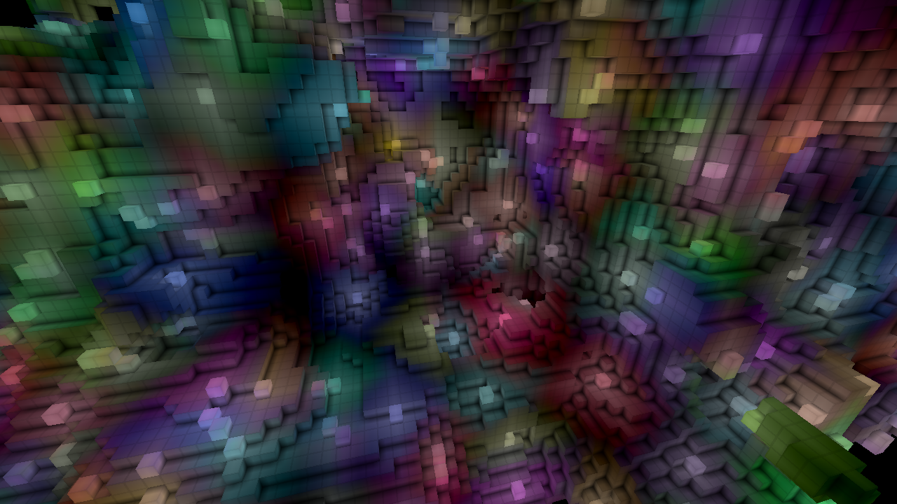
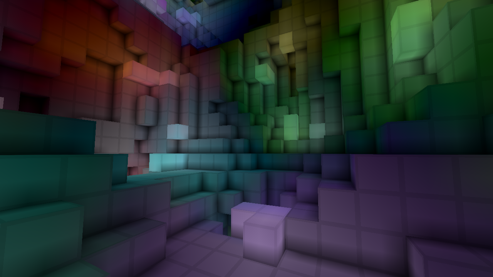
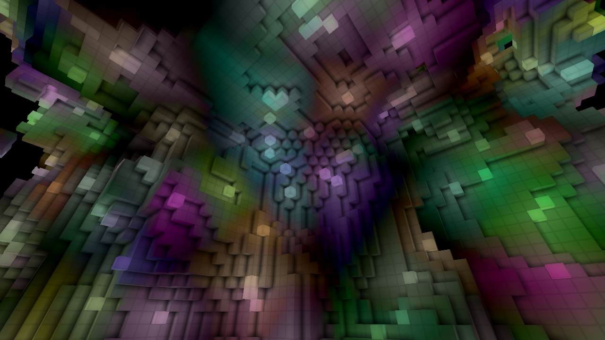

# Voxel Lighting

Flood fill lighting implementation for Godot 4.5.

## Screenshots

## Controls

- W, A, S, D, Q, E - movement
- Mouse or Left, right, down, up arrow keys - rotation
- Esc - quit (it doesn't close immediately because it waits for the thread to
complete)